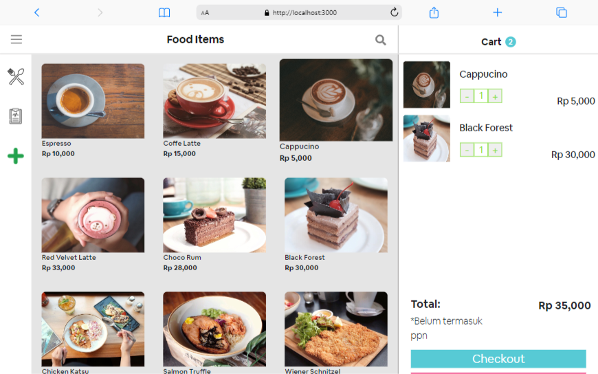
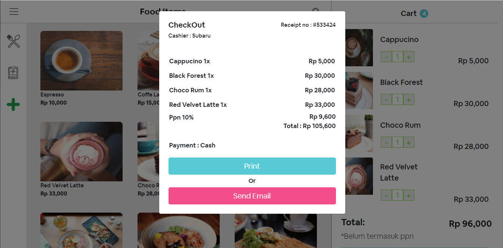
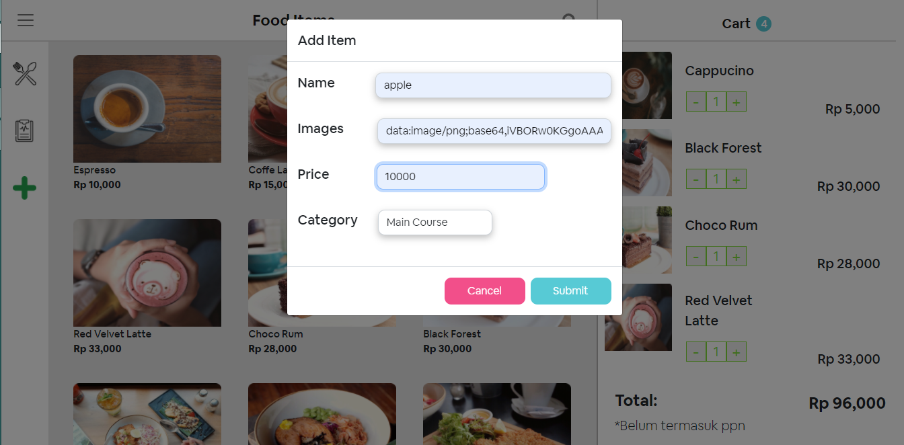
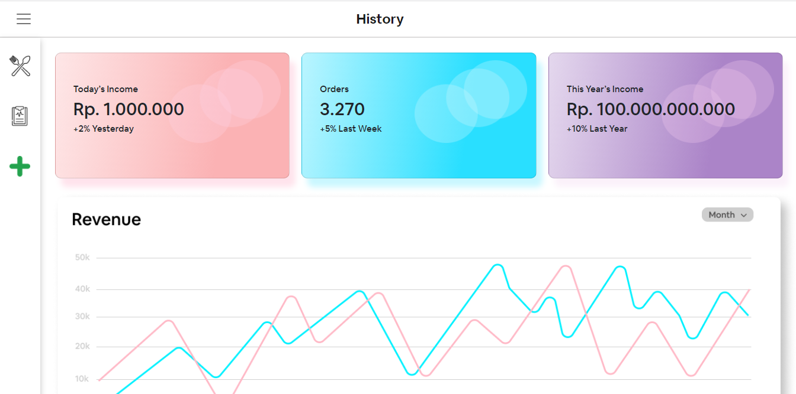

<div id="top"></div>

<!-- PROJECT LOGO -->
<br />
<div align="center">

<h3 align="center">POS ORDER FOOD</h3>

  <p align="center">
    React JS Point of Sale App
    <br />
    ·
    
  </p>
</div>


<!-- TABLE OF CONTENTS -->
<details>

  <ol>
    <li>
      <a href="#about-the-project">About The Project</a>
      <ul>
        <li><a href="#built-with">Built With</a></li>
      </ul>
    </li>
    <li>
      <a href="#getting-started">Getting Started</a>
      <ul>
        <li><a href="#installation">Installation</a></li>
      </ul>
    </li>
    <li><a href="#screenshot">Screenshot</a></li>
    <li><a href="#contact">Contact</a></li>
  </ol>
</details>


<!-- ABOUT THE PROJECT -->
## About The Project




<p align="right">(<a href="#top">back to top</a>)</p>


### Built With

* [React.js](https://reactjs.org/)

<p align="right">(<a href="#top">back to top</a>)</p>


<!-- GETTING STARTED -->
## Getting Started

Point of Sales Order a Food is a React simple point of sales web application built for
restaurants to help cashiers calculate buyer purchases. This app is built with react.
Equipped with an automatic count feature, and adding products.


### Installation

1. Clone the repo
   ```sh
   git clone https://github.com/farizian/week14
   ```
2. Install NPM packages
   ```sh
   npm install
   ```
3. Start the Application
   ```js
   npm start;
   ```

<p align="right">(<a href="#top">back to top</a>)</p>


<!-- ROADMAP -->
## Screenshot

Order a Food           |  CheckOut
:-------------------------:|:-------------------------:
  |  

Add New Product           |  History Page
:-------------------------:|:-------------------------:
  |  

<p align="right">(<a href="#top">back to top</a>)</p>


<!-- CONTACT -->
## Contact

Fariz Irfan Rifai  - [@instagram](https://www.instagram.com/farizirfan008/) - farizirfan8@gmail.com


<p align="right">(<a href="#top">back to top</a>)</p>

